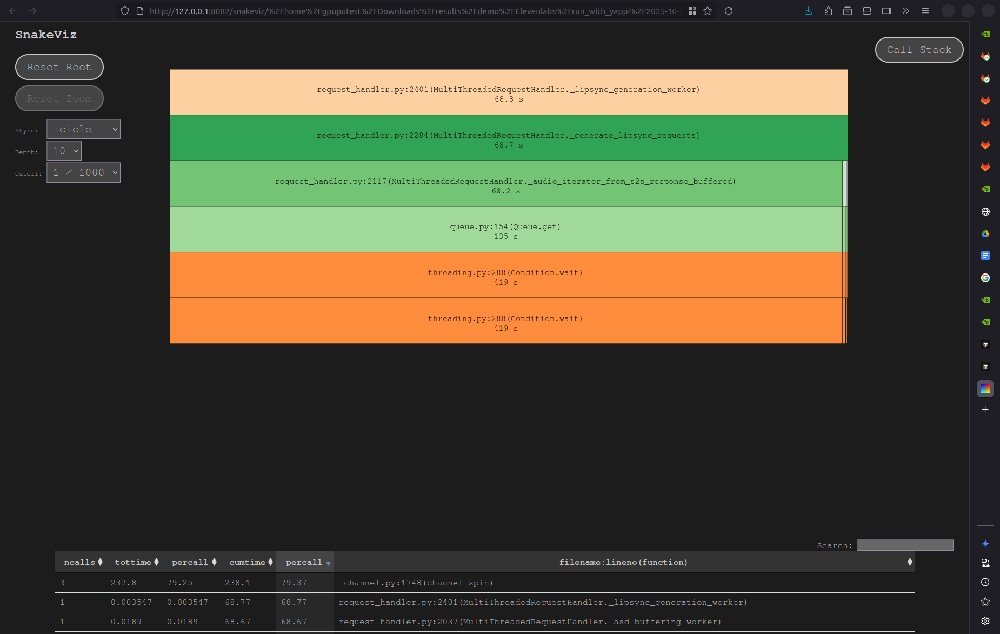
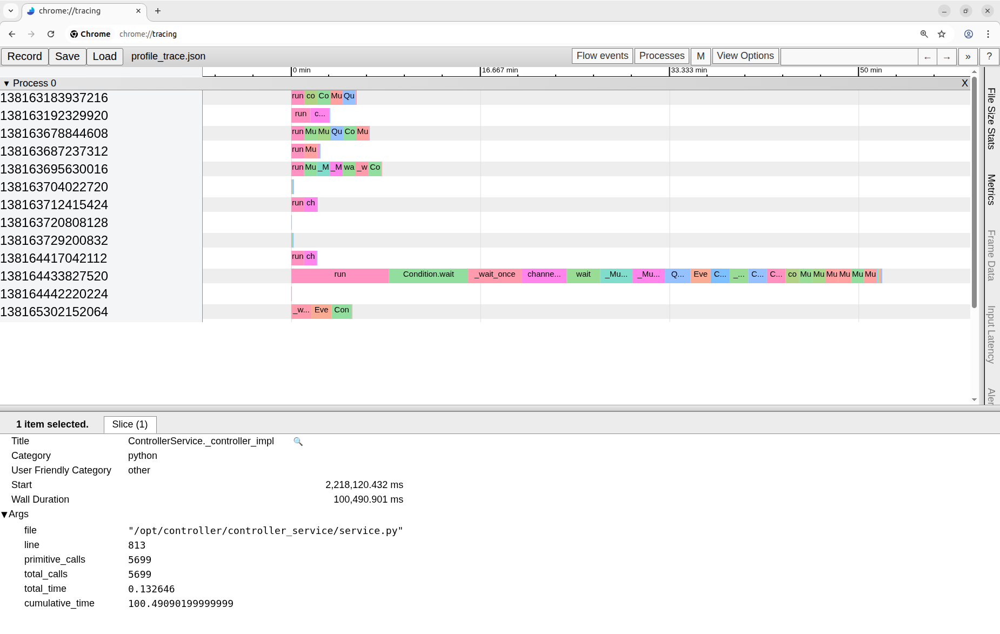
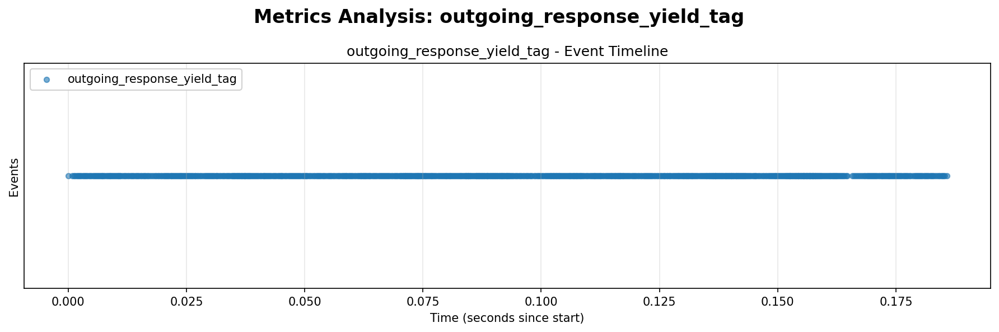
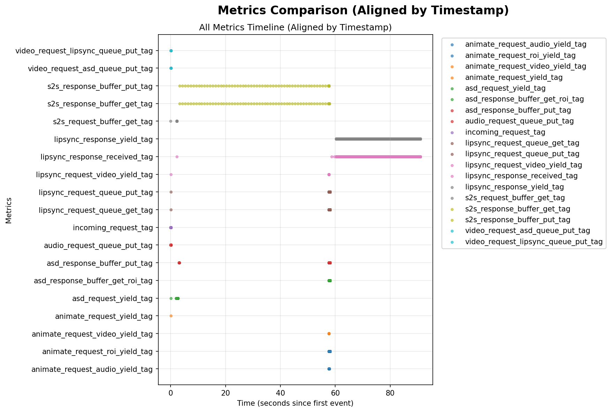

.. _profiling:

Profiling Guide
===============

This project supports profiling using available python profiling tools. Infrastructure has been added to support recording, saving and visualisation. This feature is limited to controller only.

----

Quick Start
-----------

Profiling Quick Start
~~~~~~~~~~~~~~~~~~~~~

**Step 1: Enable Profiling**

.. code-block:: bash

   export CONTROLLER_PROFILER=1
   export CONTROLLER_PROFILER_TYPE=cprofiler  # or yappi for multi-threaded

**Step 2: Run the Service**

.. code-block:: bash

   docker compose --env-file .env --env-file configs/elevenlabs.env --profile controller-third-party-s2s up

Please select the profile name and environment file to suit your needs.

**Step 3: Send Requests**

Use the controller client as shown below or use the web UI to process content. Make sure to execute from inside the virtual environment (.venv). Profiling data is automatically saved to ``volumes/profiler/YYYY-MM-DD_HH-MM-SS/infer_<uuid>/``.

.. code-block:: bash

   python3 client/controller/app.py

**Step 4: Visualize Results**

**Option 1:** SnakeViz (Hierarchical View):

.. code-block:: bash

   snakeviz volumes/profiler/<timestamp>/infer_<uuid>/profile_overall.prof

**Option 2:** Chrome Tracing (Timeline View):

.. code-block:: bash

   # 1. Open Chrome browser
   # 2. Navigate to: chrome://tracing
   # 3. Click "Load" and select: volumes/profiler/<timestamp>/infer_<uuid>/profile_trace.json

Since only yappi profiler supports multi-threaded profiling, you will see multiple threads in the timeline view when CONTROLLER_PROFILER_TYPE is set to yappi.

----

Metric Tracker Quick Start
~~~~~~~~~~~~~~~~~~~~~~~~~~~

**Step 1: Enable Metric Tracker**

.. code-block:: bash

   export CONTROLLER_METRIC_TRACKER=1

**Step 2: Run the Service**

Build the controller container and run the service as shown below.

.. code-block:: bash

   docker compose --env-file .env --env-file configs/elevenlabs.env --profile controller-third-party-s2s up --build

**Step 3: Send Requests**

Open a new terminal window and enter the virtual environment (.venv). Process content through the controller as shown below. Metrics are automatically collected and saved when the request completes.

.. code-block:: bash

   source .venv/bin/activate
   python3 client/controller/app.py

**Step 4: Check Saved Statistics**

Metrics will be saved in the ``volumes/profiler/`` directory. Raw data for each metric will be saved in the ``volumes/profiler/raw_data_<timestamp>/`` directory. Aggregated metrics will be saved in the ``volumes/profiler/metrics_<timestamp>`` file.
The metrics are also aggregated (max, min, average) and saved in the ``volumes/profiler/metrics_<timestamp>`` file.

**Step 5: Visualize Metrics**

You can use the ``client/utilities/plot_metrics.py`` script to visualize the metrics and save the plots as images.

.. code-block:: bash

   # Generate plots for all metrics
   python client/utilities/plot_metrics.py volumes/profiler/raw_data_<timestamp>/ -o outputs/metrics_plots/

----

Advanced Usage
==============

This section provides detailed information on profiler configuration, custom profiling, output formats, visualization options, and metric tracking.

Profiling
---------

Profiling Custom Code
~~~~~~~~~~~~~~~~~~~~~

In the current implementation, only ``infer`` method is profiled. 
To profile specific sections of code, you can use the profiler interface as shown below.

.. code-block:: python

   from profiler.cprofile_profiler import CProfileProfiler

   profiler = CProfileProfiler()
   profiler.start(func_name="operation_name")
   try:
       # Your code to profile
       perform_operation()
   finally:
       profiler.stop()

**Key Points:**

* Use unique ``func_name`` to separate profiles (e.g., ``f"process_{request_id}"``)
* Always use ``try/finally`` to ensure ``stop()`` is called
* Output saved to ``volumes/profiler/YYYY-MM-DD_HH-MM-SS/<func_name>/``

*Example:*

.. code-block:: python

   from profiler.cprofile_profiler import CProfileProfiler
   import uuid

   def process_video(video_path):
       """Process video with profiling."""
       request_id = str(uuid.uuid4())
       profiler = CProfileProfiler()
       
       profiler.start(func_name=f"video_processing_{request_id}")
       try:
           # Load video
           video = load_video(video_path)
           
           # Process frames
           for frame in video.frames:
               processed_frame = process_frame(frame)
               encode_frame(processed_frame)
           
           # Save output
           save_video(processed_frames)
       finally:
           profiler.stop()

Output Formats
~~~~~~~~~~~~~~

Profiler generates profile data in two formats:

1. **pstats Format** (``.prof`` files)

Standard Python profiling format that contains:

* Function call counts
* Execution times
* Call relationships
* Can be analyzed with Python tools

2. **Chrome Trace Format** (``.json`` files)

Modern trace event format for visualization:

* Interactive timeline view
* Function durations and relationships
* Detailed metadata (file, line, timing)
* Industry-standard format

For each run of profiler, the **Timestamped Profiler Folder** (``YYYY-MM-DD_HH-MM-SS/``) is generated in ``./volumes/profiler/``:

Example:

.. code-block:: bash

   volumes/profiler/YYYY-MM-DD_HH-MM-SS/infer_<uuid>/
   ├── profile_overall.prof         # cProfile/yappi binary output
   ├── profile_thread_N.prof        # Per-thread data (yappi only)
   └── profile_trace.json           # Chrome trace format (for visualization)

Viewing & Analyzing Results
~~~~~~~~~~~~~~~~~~~~~~~~~~~~

Option 1: View .prof files with SnakeViz
^^^^^^^^^^^^^^^^^^^^^^^^^^^^^^^^^^^^^^^^^

**SnakeViz** provides an interactive visualization of pstats files. Snakeviz is already installed in the virtual environment (.venv).

View Profile Data
"""""""""""""""""

.. code-block:: bash

   # Open the profile in your browser
   snakeviz profile_overall.prof

   # View a specific thread (yappi)
   snakeviz profile_thread_0.prof

A new browser window will open with the SnakeViz interface.

**What You Get:**

* **Sunburst diagram** - Hierarchical view of function calls
* **Icicle diagram** - Alternative hierarchical view
* **Function table** - Sortable statistics
* **Interactive** - Click to zoom and explore

SnakeViz Tips
"""""""""""""

.. code-block:: bash

   # Specify custom port
   snakeviz --port 8090 profile.prof

   # Use different hostname
   snakeviz --hostname 0.0.0.0 profile.prof

   # Disable browser auto-open
   snakeviz --server profile.prof

Option 2: View Chrome Trace in Browser
^^^^^^^^^^^^^^^^^^^^^^^^^^^^^^^^^^^^^^^

**Chrome Tracing** provides a timeline-based visualization.

Open Chrome Tracing
""""""""""""""""""""

1. **Open Chrome or Chromium browser**
2. **Navigate to** ``chrome://tracing``
3. **Click "Load"** button in the top-left
4. **Select** ``profile_trace.json`` file
5. **Explore** the timeline!

Chrome Tracing Controls
""""""""""""""""""""""""

**Navigation:**

* **W/S** - Zoom in/out
* **A/D** - Pan left/right
* **Mouse wheel** - Zoom at cursor
* **Click + drag** - Pan timeline
* **Shift + drag** - Select region

**Viewing:**

* **Click on event** - See detailed information
* **1/2/3/4** - Switch view modes
* **?** - Show help and shortcuts

**What You See:**

* **Timeline view** - Horizontal bars showing function durations
* **Multiple rows** - Each thread on its own row (yappi)
* **Color-coded** - Different colors for visual distinction
* **Metadata** - Click any event to see file, line, times, call counts

Metric Tracking
---------------

The controller includes a ``MetricsTracker`` singleton class that allows you to track timestamps for any events in your code. This is useful for measuring timing, frequency, and intervals of operations like service requests, responses, frame processing, etc.

Default Metrics Tracked
~~~~~~~~~~~~~~~~~~~~~~~

The tracking for the following metrics/events is already implemented in the controller service. You may search for the respective tags to check where the metric/event is tracked:

.. list-table::
   :header-rows: 1
   :widths: 30 40 30

   * - Metric Name
     - Description
     - Location
   * - ``incoming_request``
     - Incoming client request timestamps
     - Request consumption
   * - ``audio_request_queue_put``
     - Audio request queue write timestamps
     - Queue management
   * - ``video_request_asd_queue_put``
     - Video request (ASD) queue write timestamps
     - Queue management
   * - ``video_request_lipsync_queue_put``
     - Video request (LipSync) queue write timestamps
     - Queue management
   * - ``s2s_request_buffer_get``
     - S2S request buffer read timestamps
     - Buffer management
   * - ``asd_request_yield``
     - ASD request yield timestamps
     - ASD generator
   * - ``lipsync_request``
     - LipSync request timestamps (config + chunks)
     - Request generation
   * - ``lipsync_request_video_yield``
     - LipSync video chunk yield timestamps
     - Video generator
   * - ``lipsync_request_queue_put``
     - LipSync request queue write timestamps
     - Queue management
   * - ``lipsync_request_queue_get``
     - LipSync request queue read timestamps
     - Queue management
   * - ``s2s_response_buffer_put``
     - S2S response buffer write timestamps
     - Buffer management
   * - ``s2s_response_buffer_get``
     - S2S response buffer read timestamps
     - Buffer management
   * - ``asd_response_buffer_put``
     - ASD response buffer write timestamps
     - Buffer management
   * - ``asd_response_buffer_get``
     - ASD response buffer read timestamps
     - Buffer management
   * - ``animate_request_video_yield``
     - Animate video yield timestamps
     - Animate generator
   * - ``animate_request_audio_yield``
     - Animate audio yield timestamps
     - Animate generator
   * - ``animate_request_speaker_info_yield``
     - Speaker info yield timestamps
     - Animate generator
   * - ``lipsync_response_received``
     - LipSync response received timestamps
     - Response processing
   * - ``outgoing_response_yield``
     - Outgoing response yielded timestamps
     - Response output

These metrics tracking is enabled only when ``CONTROLLER_METRIC_TRACKER=1``.

How to Track New Metrics/Events in Controller Code
~~~~~~~~~~~~~~~~~~~~~~~~~~~~~~~~~~~~~~~~~~~~~~~~~~~

The ``MetricsTracker`` records timestamps for events throughout the controller code. These timestamps are automatically analyzed to provide statistics like event counts, intervals, and timing information. All metric tracking calls have **zero overhead** when tracking is disabled.

Step 1: Enable Metric Tracking
^^^^^^^^^^^^^^^^^^^^^^^^^^^^^^^

Enable metric tracking by setting the ``CONTROLLER_METRIC_TRACKER`` environment variable to ``1`` in your ``.env`` file or set it before starting the service.

.. code-block:: bash

   export CONTROLLER_METRIC_TRACKER=1

Step 2: Import and Access MetricsTracker
^^^^^^^^^^^^^^^^^^^^^^^^^^^^^^^^^^^^^^^^^

The ``MetricsTracker`` is already initialized in the controller service and request handler as a singleton:

.. code-block:: python

   from profiler.metrics_tracker import MetricsTracker

   # Available in controller code as:
   self.metric_tracker = MetricsTracker()

Step 3: Record Metric Events
^^^^^^^^^^^^^^^^^^^^^^^^^^^^^

To track an event, call ``record_metric()`` with a metric name and timestamp:

.. code-block:: python

   import time

   # Record a metric event with current timestamp
   self.metric_tracker.record_metric("my_metric", time.time())

Ensure the metric name is a valid string and is not already used for tracking another event. Metrics are registered on first use and do not add any overhead when tracking is disabled.

Step 4: Example - Tracking LipSync Requests
^^^^^^^^^^^^^^^^^^^^^^^^^^^^^^^^^^^^^^^^^^^^

Here's how ``lipsync_request`` is used in ``request_handler.py``:

.. code-block:: python

   def _lipsync_request_iterator_multithreaded(self):
       """Generate lipsync requests and track each one."""
       
       # Track the initial request
       self.metric_tracker.record_metric("lipsync_request", time.time())
       
       # Yield configuration
       yield AnimateRequest(config=AnimateConfig(**lipsync_config))
       
       # Track each chunk sent to lipsync service
       for requests in zip_longest(*iterators, fillvalue=None):
           if video_request is not None:
               # Track video chunk
               self.metric_tracker.record_metric("lipsync_request", time.time())
               yield AnimateRequest(input=video_request)
           
           if audio_request is not None:
               # Track audio chunk
               self.metric_tracker.record_metric("lipsync_request", time.time())
               yield AnimateRequest(input=audio_request)
           
          if speaker_info_request is not None:
              # Track speaker info chunk
               self.metric_tracker.record_metric("lipsync_request", time.time())
              yield AnimateRequest(input=speaker_info_request)

This tracks every request chunk sent to the LipSync service, allowing you to:

* Count total requests
* Measure request frequency
* Analyze request intervals
* Identify timing patterns

Step 5: Metric Data Output
^^^^^^^^^^^^^^^^^^^^^^^^^^^

Metrics are **automatically saved** at the end of processing. The controller generates two types of output:

**1. Raw Data Folder** (``raw_data_<timestamp>/``)

* Contains individual CSV files per metric
* Each file has timestamp and datetime columns
* Located in ``./volumes/profiler/``

**2. Aggregated Metrics File** (``metrics_<timestamp>``)

* Summary statistics for all metrics
* Includes count, intervals (min/max/avg), and timestamps
* CSV format for easy analysis

**Example Output Structure:**

::

   volumes/profiler/
   ├── raw_data_2025-10-14_15-44-55/
   │   ├── lipsync_request.csv      # All lipsync request timestamps
   │   ├── lipsync_response.csv     # All lipsync response timestamps
   │   ├── asd_response.csv         # All ASD response timestamps
   │   └── s2s_response.csv         # All S2S response timestamps
   │
   └── metrics_2025-10-14_15-44-55      # Aggregated statistics (all metrics)

**Raw Data CSV Format** (``lipsync_request.csv``):

.. code-block:: text

   timestamp,datetime
   1760456605.43,2025-10-14 15:43:25
   1760456605.45,2025-10-14 15:43:25
   1760456605.47,2025-10-14 15:43:25
   ...

**Aggregated Metrics CSV Format:**

.. code-block:: text

   metric_name,count,first_timestamp,last_timestamp,first_datetime,last_datetime,min_interval,max_interval,avg_interval
   lipsync_request,5699,1760456605.43,1760456695.28,2025-10-14 15:43:25,2025-10-14 15:44:55,0.000099,56.20,0.016
   s2s_response,61,1760456605.43,1760456662.61,2025-10-14 15:43:25,2025-10-14 15:44:02,0.000052,56.99,0.953

**Statistics Provided:**

* ``count`` - Total number of events recorded
* ``first_timestamp`` / ``last_timestamp`` - Unix timestamps of first and last events
* ``first_datetime`` / ``last_datetime`` - Human-readable dates
* ``min_interval`` / ``max_interval`` / ``avg_interval`` - Time between consecutive events (in seconds)

Metric Visualization
~~~~~~~~~~~~~~~~~~~~

Metrics are recorded as ``.csv`` files when metric tracking is enabled. You can easily visualize any metrics/events (such as function timings, inferences, etc.) captured during profiling using the provided visualization script that uses ``pandas`` to load and plot these metrics for analysis.

Use the supplied script ``plot_metrics.py`` from the client utilities to visualize the data:

.. code-block:: bash

   python client/utilities/plot_metrics.py volumes/profiler/<timestamp>/<function>/metrics_events.csv --output outputs/metrics_plots/

* This will generate plots of metric events (such as start/end events, durations, etc.) in the ``outputs/metrics_plots/`` directory.

A new image is created for each metric and a timeline chart called ``metrics_comparison.png`` is created. This chart plots each event on a timeline for the entire duration of the profiling session.

----

Troubleshooting
---------------

Profiling Not Enabled
~~~~~~~~~~~~~~~~~~~~~

**Symptom:** No profile files generated

**Solution:**

.. code-block:: bash

   # Verify environment variable is set
   echo $CONTROLLER_PROFILER  # Should show "1"

   # Set it if not
   export CONTROLLER_PROFILER=1

   # Check service logs for profiling messages
   docker compose logs controller | grep -i profil

SnakeViz Issues
~~~~~~~~~~~~~~~

**Issue:** ``snakeviz: command not found``

**Solution:**

Activate the virtual environment (.venv) and run from inside the virtual environment.

.. code-block:: bash

   source .venv/bin/activate

**Issue:** SnakeViz won't open in browser

**Solution:**

.. code-block:: bash

   # Use --server flag and open manually
   snakeviz --server profile.prof
   # Then open http://localhost:8080 in your browser

   # Or specify custom port
   snakeviz --port 9000 profile.prof

Chrome Trace Issues
~~~~~~~~~~~~~~~~~~~

**Issue:** Trace file won't load in Chrome

**Solutions:**

.. code-block:: bash

   # Verify JSON is valid
   python3 -m json.tool profile_trace.json > /dev/null
   echo $?  # Should be 0

   # Check file size (Chrome handles up to ~100MB)
   ls -lh profile_trace.json

   # If too large, profile for shorter duration

**Issue:** Can't see threads separately

**Solution:**

* Make sure you used **yappi** profiler (not cProfile)
* cProfile doesn't support per-thread visualization
* Each thread should appear on its own row in Chrome trace

Large Profile Files
~~~~~~~~~~~~~~~~~~~

**Issue:** Files too large to open

**Solutions:**

.. code-block:: bash

   # Profile for shorter duration
   # Or profile specific sections of code

   # For Chrome trace: Filter in browser
   # Chrome tracing has built-in filtering (press '/' in chrome://tracing)

   # For SnakeViz: Use command-line filtering
   python -m pstats profile_overall.prof
   # Then use 'strip_dirs()' and 'sort_stats()' commands

Permission Errors
~~~~~~~~~~~~~~~~~

**Issue:** Cannot write profile files

**Solution:**

.. code-block:: bash

   # Check directory permissions
   ls -ld volumes/profiler/

   # Create directory if needed
   mkdir -p volumes/profiler/
   chmod 755 volumes/profiler/

   # Or set custom output directory with write permissions
   export CONTROLLER_PROFILER_OUTPUT_DIR=/tmp/profiler/

----

References
----------

Profiler Options
~~~~~~~~~~~~~~~~

Comparison of Profilers
^^^^^^^^^^^^^^^^^^^^^^^

Two profiler options are directly supported. You may select one of them by setting the CONTROLLER_PROFILER_TYPE environment variable.

.. code-block:: bash

   export CONTROLLER_PROFILER_TYPE="yappi"  # or cprofiler

1. **cProfile** (Default, Recommended for Most Cases)

**When to Use:**

* Single-threaded applications
* General CPU profiling
* Lower overhead requirements
* Quick profiling sessions

**Characteristics:**

* Built into Python (no extra dependencies)
* ~10-20% overhead
* Fast and reliable
* Best for single-threaded code

2. **yappi** (For Thread-wise profiling)

**When to Use:**

* Multi-threaded applications
* Need to analyze thread interactions
* Want per-thread statistics
* Debugging concurrency issues

**Characteristics:**

* ~20-30% overhead
* Per-thread profiling
* Tracks actual OS thread IDs
* Generates merged trace with all threads

When to Use Each Tool
^^^^^^^^^^^^^^^^^^^^^

.. list-table::
   :header-rows: 1
   :widths: 35 20 25

   * - Scenario
     - Profiler
     - Viewer
   * - Single-threaded optimization
     - cProfile
     - SnakeViz or Chrome
   * - Multi-threaded debugging
     - yappi
     - Chrome Trace
   * - Call hierarchy analysis
     - cProfile
     - SnakeViz
   * - Timing/bottleneck analysis
     - cProfile/yappi
     - Chrome Trace
   * - Thread interaction analysis
     - yappi
     - Chrome Trace
   * - Quick profiling
     - cProfile
     - SnakeViz

Component Overview
~~~~~~~~~~~~~~~~~~

* **``cprofile_profiler.py``** - CPU profiler using Python's built-in cProfile
* **``yappi_profiler.py``** - Multi-threaded profiler using yappi
* **``profiler_interface.py``** - Base interface for all profilers
* **``metrics_tracker.py``** - Track custom metrics and timestamps
* **``plot_metrics.py``** - Visualize metrics data
* **``pstats_to_trace.py``** - Convert pstats to Chrome trace event format

Related Resources
~~~~~~~~~~~~~~~~~

* **Chrome Trace Format Spec:** https://docs.google.com/document/d/1CvAClvFfyA5R-PhYUmn5OOQtYMH4h6I0nSsKchNAySU/
* **Python cProfile:** https://docs.python.org/3/library/profile.html
* **Yappi Documentation:** https://github.com/sumerc/yappi
* **SnakeViz Documentation:** https://jiffyclub.github.io/snakeviz/
* **Perfetto (Alternative Viewer):** https://ui.perfetto.dev/
